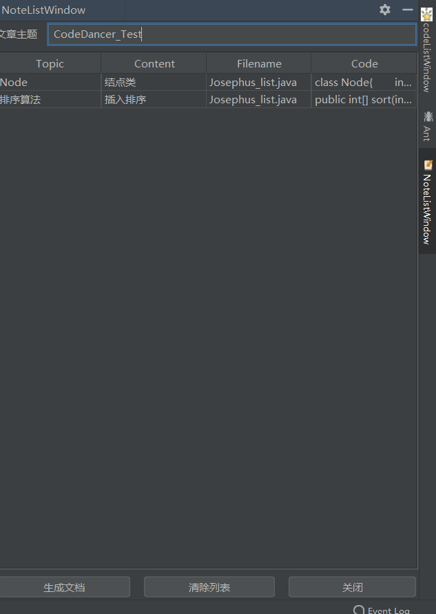

# Code Dancer

## 目录

[TOC]

## 项目信息

* **小组成员**:

|  姓名  |   学号    |             分工             |
| :----: | :-------: | :--------------------------: |
| 郭子坤 | 191830046 |  插件交互 代码整合 数据分析  |
| 孟剑卫 | 191830106 | 代码质量 相似度检验 插件测试 |
| 翟翊翎 | 181250181 | 代码库构建 语言区分 插件测试 |

* **GitHub地址**：  https://github.com/mengjianwei12345/-/tree/master
* **插件名: **  **CodeDancer**
* **插件使用说明**： **见附录6.1**
* **项目演示视频：**https://github.com/mengjianwei12345/-/blob/master/%E6%8F%92%E4%BB%B6%E4%BD%BF%E7%94%A8.mp4

## 摘要

程序员以手工方式精确编写实现程序仍是当今开发的主流。而在如今开源环境下，降低学习成本，提高代码质量与开发效率尤为重要。因此我们小组开发了名为CodeDancer的idea插件，其主要包括代码推荐与代码笔记两种功能。代码推荐主要利用开源代码爬虫构建代码库，基于字符串匹配算法和图相似算法通过余弦检测计算相似度，再根据`Halstead`进行复杂度度量推荐相应算法；代码笔记主要利用可扩展静态模板类自动生成markdown笔记，以帮助萌新于无声处听惊雷。旨在提高coder过程体验，成为一名真正的Code Dancer。在开源的世界里起舞。

## 一. 绪论

### 1.1 研究背景

过去几十年间计算科学领域取得了长足进展，但编写计算机软件的实操过程却没有根本性转变——程序员必须使用专门的编程语言，以手工方式一步一步地精确编写程序中各项算法逻辑。

尽管多年来编程语言变得越来越友好，但是学习如何编程仍然令大多数计算机用户望而却步。而实际上，在日常编程中，大部分的代码逻辑是相对固定的，比如排序、加密、负载均衡、任务调度等。而在开源环境下，存在着诸多可以借鉴的代码。

### 1.2 研究意义

1. 有效提高编写代码效率，得到多份实现对应功能的代码
2. 有效提高编写代码质量，所推荐代码均按相应质量指标排序
3. 阅读源码或进行代码学习时，通过插件添加笔记功能。依照静态模板类自动生成markdown代码记录，一遍之后学习
4. 用户友好型，通过插件交互，便捷快速

## 二 . 数据获取

### 2.1 数据概况

**数据源**：本次研究数据主要来源于[GitHub](https://github.com/)，少部分来源于[Gitee](https://gitee.com/)等其他代码托管平台。

**代码语言**：Java、python、c++，其中Java代码文件数量最多，约占代码文件总数的56%。

**代码功能分类**：排序算法、 加密算法 、负载均衡算法。 其中排序算法代码文件数量最多，约占代码文件总数的37%。

**代码库总容量：**总共代码库合计约750份代码文件，总代码行数五万行左右。

### 2.2 数据获取

#### 2.2.1 网络爬虫

包含特定关键字`GitHub`代码的思路是：首先爬取包含特定关键字代码的仓库名，再将其作为参数去调用官方`API`得到`.json`文件，最后解析这个文件以获取下载链接和一些其他信息。

**主要过程如下**：

* 爬取包含特定关键字代码的仓库名

  使用快捷键F12进入开发者模式，观察GitHub网页中关于作者和仓库名显示的标签：

  

  ```python
  //发现其HTML的特点，使用`BeautifulSoup`的findall方法爬取仓库名
  pattern = soup.find_all('a', class_='text-bold')
  ```


* 调用官方API解析

  针对用户一些自动化的需求，GitHub提供了官方API。使用[搜索](https://docs.github.com/cn/rest/reference/search#search-code)API可以直接得到一个json文件用于后续解析。例如：

  ```
  https://api.github.com/search/code?q=main+in:file+language:java+repo:rishidewan33/Advanced-Encryption-Standard-Algorithm
  //表示在rishidewan33用户的Advanced-Encryption-Standard-Algorithm仓库里包含main方法的java代码片段
  ```

  该网址指向的json文件如图所示。

  


  但经过实践后我们发现爬虫工作的效果并不好。一个主要问题是关键字的定位范围过于粗糙，下载的代码粒度不一、功能各异，出现了冗长的工程代码、无效的控制代码甚至未完成的代码。尤其是在负载均衡算法中，不相关代码的比例相当高，这给我们的代码相似度检测和代码质量评估工作引入了不确定性。

#### 2.2.2 人工筛选

在对爬取的数据进行基于可用性的筛选后，数据量有了一定缩减，因此我们试图将数据集进一步扩充。

不过GitHub默认是不支持下载存储在仓库中的部分内容的，通常需要使用某个项目就必须下载该项目的所有文件。为此，我们参考了腾讯云专栏[如何从 GitHub 上下载指定项目的单个文件或文件夹](https://cloud.tencent.com/developer/article/1463081)。通过基于Chrome的插件GitZip极大地提高了工作效率。


除此之外，我们观察各类算法的实现代码，并为每一类算法总结了关键词以丰富我们的搜索范围。例如，对于加密算法，关键词（包括常见加密算法名）如下：

```
"aes"，"affine"，"atabash"，"bellaso"，"blowfish"，"ceaser"，"criptografia"，"des"，"Vigenere"，"md"，"paillier"，"playfair"，"rc4"，"rsa"，"sha"，"sm"，"Vernam","hill","substitution"，"tea"，"tinye"，"encode"，"decode"，"cipher"，"vector"，
"shift"，"rotate"，"column"，"symmetric"，"asymmetric"；
```

在一些细节调整后，这些关键词也被用于后续基于文本的算法分类工作中。

### 2.3 数据初步处理

#### 2.3.1 数据分类

通过源代码文件的后缀进行语言判断，进而将其复制到不同的文件夹实现分类。

使用`java nio Files.newDirectoryStream`打开目录，返回`DirectoryStream`以遍历目录中的所有条目，通过正则表达式过滤文件名。后缀判断代码大致如下：

```java
public static void main(String[] args) throws IOException{
        Path dir = Paths.get("E:\\encrypt");   //文件目录
        Path target = Paths.get("E:\\encrypt\\java");    //目标目录
        try (DirectoryStream<Path> stream = Files.newDirectoryStream(dir, "*.{java}")) {    //筛选文件类型
            for (Path entry: stream) {
                Files.copy(entry,target.resolve(entry.getFileName()));
            }
        } catch (DirectoryIteratorException ex) {
            throw ex.getCause();
        }
    }
```

#### 2.3.2 数据格式化

为方便代码推荐，需要对代码文件名和文件内容进行格式化处理。

对于文件名的处理，我们使用了`bat批处理`，例如为每一种算法的代码文件添加前缀标签：

```python
@echo off
for /f "delims=" %%f in ('dir/b/s/a-d *.java') do (if not "%%~nxf"=="%0" ren "%%f" "encrypt_%%~nxf")
pause
```

对于文件内容的处理，我们使用了notepad++的正则表达式查找功能，例如删去代码中的import语句，匹配正则为：

```python
import.+.;
```

## 三 . 研究方法

### 3.1 代码相似度

程序的相似度检测与一般文本的相似度检测不同的是：文本主要检测在一段文字范围内文本的重复数目，而我们所书写的代码都较为简单，编程语言的关键字和系统函数名、系统提供的类库中的类名占相当大的比例，而这些不应当做为相似度检测的依据，而应当从程序本身的特征入手。

​        程序的源代码可以视为一种连续的标记串（Token String）。通过比较标记串获取相似程度的信息。对提交的电子档程序，两两之间进行雷同检测，最终给出相似度计算结果。

#### 3.3.1 概要

 提取程序源代码的结构特征，将程序按照关键字序列、自定义变量序列、自定义函数序列、函数调用关系、括号匹配关系等分别计算相似度，并利用样本确定各种相似度的权重，最后确定整个代码的权重。

采用现有的较好的文本匹配算法：**串匹配算法**

该算法具有以下特点：

1. 速度快：字符匹配速度能以线性速度执行
2. 内存占用少。

#### 3.3.2 相关综述

代码相似度的检验与代码抄袭息息相关，而我们也对我们学校计算机系jyy所建立的一套代码抄袭检测系统，好让学生“酸爽”地完成ICS OS等大作业，因此了解相关内容对于代码相似度检测意义非凡。

我们组在查阅相关相似度检验时，了解到的有关背景材料。

**国内外典型代码抄袭检测系统**：

​        许多国外的大学都已建立了自己的计算机程序抄袭检测系统，如：美国斯坦福大学的MOSS系统、德国卡尔斯鲁厄大学JPlag系统、美国威奇塔州立大学的SIM系统、澳大利亚悉尼大学的YAP3系统等。这些系统都是综合利用程序相似度计算技术中的基于属性计数的方法和基于结构度量的方法来作为实现计算机程序抄袭检测系统的关键技术的。国内对计算机程序抄袭检测、对编程题目及主观题目的相关研究也逐步深入。如：中国人民警官大学的张文典和任冬伟开发了一个PASCAL语言程序抄袭检测系统、北京邮电大学采用了基于SML方法的结构度量方法进行相似度的计算，并实现了相应的实验系统。

​        从国内外的研究现状可以发现，国内对程序相似度判别的研究做的非常少，大部分集中在对中文分词和语义的研究上。程序代码的抄袭跟普通文本抄袭还有不同，不同的代码可能实现同样的功能，有些聪明的抄袭者会使用一些技巧对代码进行修改，比如for循环变成while循环、添加很多中间变量，这样会降低串匹配算法的有效性。

#### 3.3.3 实现步骤

1. 程序代码预处理：对于系统提交的源代码文件，系统必须过滤掉源代码中对相似度检测没有影响的无关信息，加快系统运行效率，比如：注释，头文件，无用字符串，空格和空行等。这个过程是的源代码文件将大大减小，加快后面过程的处理。预处理过程相对来说比较简单，也可以在预处理的扫描过程中统计一些属性方便后面使用，这并不会增加时间复杂度。
2. 程序代码转换：基于机构化度量技术的代码反抄袭系统的主要步骤就是如何将程序代码转换成具有结构信息的新结构。以字符串匹配算法为核心的检测系统对程序做语法分析时，将代码转换成标记字符串序列，方便进行字符串匹配。以图相似算法为核心的检测系统对某语言程序做语法分析时，将代码转换成图节点，并根据控制流和变量依赖关系添加图节点之间的有向边。
3. 相似度检测：使用字符串匹配算法和图相似算法计算的相似度，从而的出比较的两段代码之间的相似度值`sim`。
4. 用相应方法将用户程序与代码库里的所有源程序进行相似度计算。将结果存储在一个`HashMap`中代码如下：

##### 3.3.3.1 程序代码转换

​        通过Java程序的处理后，可以将无效代码去除，处理程序采用的是边读边处理的办法，即读取一行代码后，立即处理一行。过滤后的有效代码可以进入下一阶段，即代码转换阶段，本程序是将分割后的代码存入`ArrayList`中，这样数组中就存放了该源程序的统计结果，之后将存有统计结果的`ArrayList`存入保存`SourcePrograme`信息的`ArrayList`中，其中存放了等待比较的源程序的所有信息（目前是指源程序中出现java语言的54个系统关键字的次数），为了避免无效比较，将首先读取用户上传的文件，处理完成后直接存放到比较数组的首位，之后依次与文件内的代码比较。分割方式：根据java语言其本身的语言特性进行分割，通过指定正则表达式进行分割，指定内容为：:`  ,  ;  (  )  &  |  空格`

源代码的`ArrayList<Interger>`中的信息，根据程序定义的Map（存放54个关键字，及其对应的数组下标）来定位与赋值操作。每当关键字出现则指定位置的数值增加一，依次类推。

##### 3.3.3.2 修正后余弦相似度

本组主要采取一种基于模型的协同过滤算法，即修正后的余弦相似度

依次遍历其中提前设定的关键词的值，将非零项均减去关键字种类出现次数，即转换为修正统计次数，具体解释如下：

`AdjustedCosineSimilarity：`下式表示将用户`u`对物品i的评价值减去用户`u`对所有物品的评价均值，从而得到修正后的评分。`s(i,j)`表示物品`i`和`j`的相似度，分子表示将同时评价过物品`i`和`j`的用户的修正评分相乘并求和，分母则是对所有的物品的修正评分做一些汇总处理。而代码中的关键字则认为是程序对其的评分，基于上式可以得出两个程序对关键字的评分相似度，即暂时认为是两代码之间的相似度。
$$
s(i,j)=\frac{\sum_{_{u\epsilon U}}^{}(R_{u,i}-\bar{R_{u}})(R_{u,j}-\bar{R_{u}})}{\sqrt{(\sum_{_{u\epsilon U}}^{}(R_{u,i}-\bar{R_{u}}))^{2}}\sqrt{(\sum_{_{u\epsilon U}}^{}(R_{u,j}-\bar{R_{u}}))^{2}}}
$$

#### 3.3.4 代码实现

这部分不再赘述 源代码文件注释已经描述比较清楚

```java
/*存放代码需要检测的全部信息
**54个关键字
**7个系统变量
*/
public class LanguageInformation {}

/**
**源程序类，每一个上传的代码视为一个源程序，存入的是程序文件信息， 以及代码内容的各种信息。
**/
public class SourcePrograme {}

/**
**此为源程序检测类，用于检测指定文件夹下的文件的相似度
**修正后的余弦相似度计算实现
**/
public class PlagiarismDetection{}
```


### 3.2 代码质量

#### 3.2.0 **整体实现**:

代码质量的检测方法有很多，我们小组主要针对代码的风格检查、重复率检查以及复杂度检查。参照了美团代码质量管理系统Litmus

我们采取Maintainability（可维护性）来衡量一个代码的复杂度，并且通过以下三个方面来定义一段代码的 Maintainability 的值：

- Halstead Volume（代码容量）
- Cyclomatic Complexity（圈复杂度）
- Lines of Code（代码行数）

根据这三个参数计算出 Maintainability，也就是代码的可维护性，[公式](https://blogs.msdn.microsoft.com/codeanalysis/2007/11/20/maintainability-index-range-and-meaning/)如下：

```
Maintainability Index = MAX(0,(171 - 5.2 * ln(Halstead Volume) - 0.23 * (Cyclomatic Complexity) - 16.2 * ln(Lines of Code))*100 / 171)复制代码
```

代码行数不做赘述，下面我们具体介绍代码容量、圈复杂的含义以及它们的计算原理

#### 3.2.1 **Halstead**复杂度 

关于代码评估我们选取了软件工程中最为常用的**Halstead**复杂性度量指标：

- Halstead 复杂度 (Maurice H. Halstead, 1977) 是软件科学提出的第一个计算机软件的分析“定律”，用以确定计算机软件开发中的一些定量规律。
- Halstead 复杂度采用一组基本的度量值，这些度量值通常在程序产生之后得出，或者在设计完成之后进行估算。
- Halstead 复杂度根据程序中语句行的操作符和操作数的数量计算程序复杂性。
  - 操作符和操作数的量越大，程序结构就越复杂。
  - 操作符通常包括语言保留字、函数调用、运算符，也可以包括有关的分隔符等。
  - 操作数可以是常数和变量等标识符。

##### 3.2.1.1 度量

在定义中，操作符包括：

　　　　算术运算符　　赋值符（＝或:＝）　　　　数组操作符
　　　　逻辑运算符　　分界符（，或；或:）　　子程序调用符
　　　　关系运算符　　括号运算符　　　　　　 循环操作符等

特别地，成对的运算符，例如`“ BEGIN…END ”、“ FOR…TO ”、“REPEAT…UNTIL”、“WHILE…DO”、“IF…THEN…ELSE”、“（…）”`等都当做单一运算符。操作数包括变量名和常数。

- 设 n1 表示程序中不同的操作符个数，n2 表示程序中不同的操作数个数，N1 表示程序中出现的操作符总数，N2表示程序中出现的操作数总数。
- Halstead 程序词汇表长度 Program vocabulary: n = n1 + n2 .
- Halstead 程序长度或简单长度 Program length: N = N1+N2
  - 注意到 N 定义为 Halstead 长度，并非源代码行数。
- 以 N^ 表示程序的预测长度 Calculated program length: N^ = n1 log2 n1 + n2 log2 n2 .程序长度的预测值，它不等于程序中语句个数。
- Halstead 的重要结论之一是：程序的实际长度 N 与预测长度 N^ 非常接近，这表明即使程序还未编写完也能预先估算出程序的实际长度 N。
- 程序体积或容量 Volume: V = Nlog2 (n)，表明了程序在词汇上的复杂性。
- 程序级别 Level（程序量比率）: L^ = (2/n1) × (n2 /N2)，表明了一个程序的最紧凑形式的程序量与实际程序量之比，反映了程序的效率。
- 程序难度 Difficulty: D = 1/L^，表明了实现算法的困难程度。对于高级语言 ，它接近于1，对于低级语言，它在0～1之间。
- 
- 编程工作量 Effort: E = V × D = V/L^ .
- 语言级别: Lʹ = L^ × L^ × V .
- 编程时间 (hours): T^ = E/(S × f)，这里 S = 60 × 60, f = 18 .
- 平均语句大小: N/语句数。
- 程序中的错误数预测值（程序的潜在错误）: B = V/3000 = Nlog2 (n)/3000 

##### 3.2.1.2 优缺点

Halstead的重要结论之一是：程序的实际 Halstead长度N可以由词汇表n算出 。即使程序还未编制完成，也能预先算出程序的实际Halstead长度N， 虽然它没有明确指出程序中到底有多少个语句。这个结论非常有用。经过多次验证，预测的 Halstead 长度与实际的Halstead长度是非常接近的。

- Halstead 方法的优点

  - 不需要对程序进行深层次的分析，就能够预测错误率，预测维护工作量；
  - 有利于项目规划，衡量所有程序的复杂度；
  - 计算方法简单；
  - 与所用的高级程序设计语言类型无关。

- Halstead 方法的缺点

  - 仅仅考虑程序数据量和程序体积，不考虑程序控制流的情况；

  - 不能从根本上反映程序复杂性。

    

例如：计算下列代码片段的 Halstead 复杂度的11项内容 ：

```java
if (month < 3) {
month += 12;
–year;
}
return dayray((int)(day + (month + 1) * 26/10 + year +year/4 + 6 * (year/100) + year/400)% 7);
```

**得到相应指标**：


- ```java
  词汇表长度（Program vocabulary ）：n = n1+n2 = 24`
  程序长度或简单长度（Program length ）：N = N1+N2 = 39`
  程序的预测长度（Calculated program length）：N^ = 11*log2（11）+13*log2（13）=86.1594641399`
  程序体积或容量（Volume ）：V=N*log2（n）= 39*log2（24）= 178.8135375273`
  程序级别（Level ）：L^ = （2/n1）*（n2/N2）= （2/11）*（13/19）=0.1244019138755980861244019138756`
  程序难度（Difficulty ）：D = 1/L^ = 8.0384615384615384615384615384614`
  编程工作量（Effort ）：E = V*D = 1437.38574396945`
  语言级别：L’ = L*L*V = 2.7672890128077379180879558618164`
  编程时间（hours ）：T^ = E/(S*F) = 0.02218187876496064814814814814815`
  平均语句大小：N / 语句数 = 39/4 = 9.75`
  程序中的错误数预测值：B = V / 3000 = 0.0596045125091`
  ```

我们可以知道Halstead可以得到程序的数维指标，不同的选取也会形成不同的代码评估方法。

而在本组的质量检测中，主要选取Halstead中的 **程序体积或容量（Volume ）**指标作为衡量的三大因素之一。

##### 3.2.1.3 计算方式

主要介绍函数中调用的接口以及相应实现方法

* 此类旨在重写ASTVisitor中的visit方法，以便计算运算符和操作数

```java
public class ASTVisitorMod extends ASTVisitor{  
   public HashMap<String, Integer> names = new HashMap<String, Integer>();
   public HashMap<String, Integer> oprt = new HashMap<String, Integer>();
   public HashMap<String, Integer> declaration = new HashMap<String, Integer>();
   CompilationUnit compilation=null;
   public boolean visit(InfixExpression node);
   //访问中缀表达式节点，如果表达式的运算符不存在于运算符哈希图中，则将其插入，否则，增加count字段。
   public boolean visit(PostfixExpression node);
   //重写访问后缀表达式节点。如果表达式的运算符不存在于运算符哈希图中，则将其插入，否则，增加count字段。
   public boolean visit(PrefixExpression node);
   //重写访问前缀表达式节点,如果表达式的运算符不存在于运算符哈希图中，则将其插入，否则，增加count字段。
   public boolean visit(Assignment node);
   //重写访问赋值语句节点，如果赋值的运算符不存在于运算符哈希图中，则将其插入，否则，增加count字段。
   public boolean visit(SingleVariableDeclaration node) ；
   //重写访问单一变量声明节点,如果变量已初始化，则将“=”运算符添加到运算符的哈希图中.
   public boolean visit(VariableDeclarationFragment node);
   //重写访问变量声明片段节点。如果变量已初始化，则将“ =”运算符添加到运算符的哈希图中
   public boolean visit(SimpleName node) ;
   //重写访问SimpleNames节点,如果名称哈希图中不存在SimpleName，则将其插入，否则，增加count字段。
   public boolean visit(NullLiteral node);
   //重写访问空节点,如果名称哈希图中不存在null，则将其插入，否则，增加count字段。
   public boolean visit(StringLiteral node);
   //访问StringLiteral节点, 如果名称哈希图中不存在字符串文字，则将其插入，否则，增加count字段。
   public boolean visit(CharacterLiteral node);
   //访问CharacterLiteral节点。如果名称哈希图中不存在字符文字，则将其插入，否则，增加count字段。
   public boolean visit(BooleanLiteral node);
   //访问BooleanLiteral节点,如果名称哈希图中不存在布尔文字，则将其插入，否则，增加count字段。
   public boolean visit(NumberLiteral node);
   //访问NumberLiteral节点,如果名称哈希图中不存在NumberLiteral，则将其插入，否则，增加count字段。
   public boolean visit(CompilationUnit unit);
   //访问compilationUnit，以便能够检索行号
}
```

* 此类旨在计算所有Halstead复杂度指标  

```java
public class HalsteadMetrics {
   
   public int DistOperators, DistOperands, TotOperators, TotOperands; 
   private int Vocabulary=0;
   private int Proglen=0; 
   private double CalcProgLen=0; 
   private double Volume=0; 
   private double Difficulty=0;
   private double Effort=0;  
   private double TimeReqProg=0;
   private double TimeDelBugs=0;

   // Initialize the variables in the constructor 
   public HalsteadMetrics() {
      DistOperators=0;
      DistOperands=0;
      TotOperators=0;
      TotOperands=0;
   }
    // calculate the Program vocabulary
    public int getVocabulary();
	// calculate the Program length
	public int getProglen();
	// calculate the Calculated program length
	public double getCalcProgLen();
	// calculate the Volume
	public double getVolume();
	// calculate the Difficulty
	public double getDifficulty();
	// calculate the Effort
	public double getEffort();
	// calculate the Time required to program
	public double getTimeReqProg();
	// calculate the Number of delivered bugs
	public double getTimeDelBugs();
}
```

#### 3.2.2  Cyclomatic Complexity

##### 3.2.2.1 基本概念

> 圈复杂度（Cyclomatic complexity，简写CC）也称为条件复杂度，是一种代码复杂度的衡量标准。由托马斯·J·麦凯布（Thomas J. McCabe, Sr.）于1976年提出，用来表示程序的复杂度，其符号为VG或是M。它可以用来衡量一个模块判定结构的复杂程度，数量上表现为独立现行路径条数，也可理解为覆盖所有的可能情况最少使用的测试用例数。圈复杂度大说明程序代码的判断逻辑复杂，可能质量低且难于测试和 维护。程序的可能错误和高的圈复杂度有着很大关系。`

##### 3.2.2.2 计算方式


如果在控制流图中增加了一条从终点到起点的路径，整个流图形成了一个闭环。圈复杂度其实就是在这个闭环中线性独立回路的个数。

如图，线性独立回路有：

- e1→ e2 → e
- e1 → e3 → e

所以复杂度为2

计算公式

```
V(G) = e – n + 2 * p
```

- e：控制流图中边的数量（对应代码中顺序结构的部分）
- n：代表在控制流图中的判定节点数量，包括起点和终点（对应代码中的分支语句）
- p：独立组件的个数
- 注意：所有终点只计算一次，即使有多个 return 或者 throw


**具体代码实现**：

```java
public class CalculateCycleAndLine :
    public int[] CaculateCycle(String path,String name) 
```

在写代码过程中由于计算控制流中的边，节点和组件的个数算法比较复杂，实现起来有一定的难度，需要大量时间，在网上也没找到相关的源码，所以采用了另一种较为简单但是并不会影响正确率的算法。现介绍如下：

Source Monitor的圈复杂度(`cyclomatic complexity`)计算方法：

(1)起始数量记为1.

(2) 遇到关键词或其等价，则加1：if  while  repeat  for  and  or

(3) 每遇到1个case语句就增加1.

(4)遇到分支则复杂度加1，分支包括 if else for each while

(5)算术性的if语句复杂度加1，例如 Boolean ? If True :If False

(6)在if for while或类似逻辑语句中出现一次&&或者||，复杂度加1

(7)switch语句每遇到一次从case来的退出就加1.这些退出包括break goto  return throw continue或者类似语句。对于default语句即使没有复杂度也要加1。

(8) 在一个try块中的每个catch或者except复杂度加1，而非try或finally语句

这样只要遍历程序中的非注释语句，每次遇到这些关键词复杂度数量加一即可。

##### 3.2.2.3 语句控制流


#### 3.2.3 结尾计算

以上通过所得到的三个指标：

- #### `Halstead Volume`（代码容量）

- `Cyclomatic Complexity`（圈复杂度）

- `Lines of Code`（代码行数）

根据这三个参数计算出 Maintainability，也就是代码的可维护性，[公式](https://blogs.msdn.microsoft.com/codeanalysis/2007/11/20/maintainability-index-range-and-meaning/)如下：

```
Maintainability Index = MAX(0,(171 - 5.2 * ln(Halstead Volume) - 0.23 * (Cyclomatic Complexity) - 16.2 * ln(Lines of Code))*100 / 171)
```


### 3.3 代码推荐

#### 3.3.1 推荐内容

我们选取的推荐粒度为完整的方法：即所显示推荐为一整个方法的代码文件

#### 3.3.2 整体流程

1. 用户选中要推荐代码段
   * 若出现特殊特判关键词则直接返回特定功能
   * 若无法特判则根据相似度匹配，在代码库中找到相似度与之最高的**十份**具有特定功能文件
     * 检查特定功能文件数量，按照数量最多来决定用户程序要推荐何种功能
     * 如果上述数量出现相等情况（如排序算法与负载均衡）均为五份，那么再根据对应相似度的平均值决定何种功能
2. 判断出相应功能后，即在对应功能的代码库里挑选十份与之相似度最高的代码（这是考虑到了用户可能的不同需求，比如加密算法又分好几种，这是为了更好推荐用户想要的特定的）代码
3. 得到具有相似度最高的十份代码之后（此时相似度代码已经是具有统一功能的代码），再通过代码质量检测得到期中代码质量最高的六份代码，进行推荐。

#### 3.3.3 具体案例

用户在idea界面编写代码后，选取该段代码，触发函数，该函数根据用户代码判断这是什么语言，并且把这段代码写入指定文件中。

文件写入成功后直接触发代码推荐类`RecommandInterface`中的start方法。

```java
public class RecommandInterface {
    public static  void start(String srcpath,String database) throws IOException {
        String a=srcpath;
        String path=database;
        Filecopy.copy(new File(a),new File(path+"/A.java"));
        //A为文件夹中空文件，旨在把用户程序拷贝到A中与文件夹中所有文件进性相似度计算。
        Launch.setDefaultPath(path);
        HashMap<String,Double> judgeresult=judge.judge("A");
        //返回这类算法的相似度最高的几个算法并根据相似度判断这是什么算法。
        HashMap<String,Double> newpp=SortingIndex.start2(judgeresult);//返回这几个算法的质量好坏程度。
        recommand.recommand(newpp);//根据好坏程度进行推荐。

    }
}
```

该方法需要传入两个参数：一个是用户代码写入的文件地址，另一个是默认的代码库地址。之后调用类judge中的judge方法判断这是什么算法，在这里我们设置了一个可以扩充的枚举类，包含这次需要用到的几种算法。judge方法先将用户文件读出，如果发现特殊关键词则不再需要对代码库中的函数进行相似度匹配。直接判断出该段代码的功能。这里系统关键词给了3类：

第一类：出现sort（常见排序算法后缀名）即判断这是排序算法；

第二类：出现如下关键词（常见负载均衡算法名）即判断这是负载均衡算法：

```
"balance”，"load"，" tcp "，" udp "，"roundrobin"，" wrr "randomload"，"response"，"dlb"，"topology"genetic"，
"consistenthash"，"HashAlgorithmImpl“，"schedule"lcf"，"WeightedRandom"，"WeightedRound"，"consistencyhash"；

```

第三类：出现如下关键字(常见加密算法名)即判断这是加密算法：

```
"aes"，"affine"，"atabash"，"bellaso"，"blowfish"，"ceaserencryption"，"cesar"，"criptografia"，" des "，"crypt"，"huffman"，"Vigenere"，"paillier"，"playfair"，"rc4"，" rsa "，" sha "，" sm2 "，" sm "，" sm3 "，" sm4 "，"sm5","Vernam","hill"substitution"，"tea"，"tinye"，"encode"，"decode"cipher"，"vector"，"rotate"，"symmetric"，"asymmetric"，"Beaufor"，"vigenere"，" ecc "，"Playfair"；
```

如果此时判断出来用户代码的功能，直接设置枚举类中的标志位，停止读用户程序。

```java
if(str.toLowerCase().contains("sort")){agrim1=Agrim.Sorting;break;}
```

然后把用户程序与对应算法库中的算法进行相似度检测，调用相似度检测类launch中的start函数，返回一个`HashMap<String, Double>`类型的变量，String部分保存文件名，Double部分保存该文件与用户文件的相似度。我们选取了加密算法一部分代码进行测试，得到部分结果如下：

`encrypt_RSA (3).java 0.38`
`encrypt_VigenereCipher.java 0.637`
`encrypt_Permutation Cipher.java -0.08`
`encrypt_AES256_CTR.java 0.387`
`encrypt_DoubleTransporationEncryption.java 0.433`
`encrypt_PolybiusSquareCipher.java 0.472`
`encrypt_AESEncryption.java 0.616`
`encrypt_SHA1 (2).java 0.446`
`encrypt_AES (2).java 0.387`
`encrypt_AtbashCipherImpl.java 0.122`
`encrypt_RSA (9).java 0.485`
`encrypt_BeaufortCipherImpl.java 0.159`
`encrypt_ColumnarTranspositionCipher.java 0.251`

`encrypt_RailFenceCipher.java -0.02`
`encrypt_RSA_4096.java 0.32`
`encrypt_CeaserEncryption.java 0.433`

之后调用一个`findkth`方法返回相似度排名前十的算法存储在一个10x2的二维数组中：第一列元素为文件名，第二列元素为相似度。

```
Object[][] kth = bTree.findkth(simi, 10);//前十高的相似度
```

得到结果显示如下：

`encrypt_CaesarCipher3.java`
`0.734`
`encrypt_RSAUtil.java`
`0.758`
`encrypt_DES (7).java`
`0.731`
`encrypt_md5 (3).java`
`0.758`
`encrypt_md5 (1).java`
`0.835`
`encrypt_Md5Hash.java`
`0.795`
`encrypt_RSA2Util.java`
`0.835`
`encrypt_BaseCiphers.java`
`0.747`
`encrypt_AESUtil (2).java`
`0.799`
`encrypt_encrypt_AES (1).java`
`0.959`

如果之前在用户程序中没有检测到这些关键词，则将用户程序直接与总代码库中的所有代码进行相似度分析,选取其中相似度排名前十大的算法。之后对这10个算法进行统计，如果几种算法数量不相等，则判断用户程序为占比最高的算法；如果有两种或两种以上算法数量相等，则对每种算法相似度进行加权求平均值，选取权重最大的算法来判断用户程序的功能。此时得到用户功能后再将用户程序与对应功能子代码库中的所有程序文件进行相似度分析，返回其中前十的算法。

至此程序功能的判定结束。

接下来运用多指标对代码进行推荐，这里我们设计了一个接口，对刚刚计算出来相似度排名前十的算法进行二次筛选，选取质量排名前六的六个算法进行推荐。

```java
HashMap<String,Double> judgeresult=judge.judge("A");//返回这类算法的相似度最高的几个算法并根据相似度判断这是什么算法。
HashMap<String,Double> newpp=SortingIndex.start2(judgeresult);//返回这几个算法的质量好坏程度。
recommand.recommand(newpp);//对其中排名前六的算法进行推荐。
```

推荐的结果将在对应插件GUI界面上进行显示。


## 四 . 插件交互

### 4.1 初始化

关于启动idea时的介绍

#### 4.1.1 启动idea欢迎对话框


捕捉idea启动事件 `ApplicationComponent`级别

添加相应`Plugin.xml`扩展

```xml
  <application-components>
    <component>
      <implementation-class>startMaker.contentDialog</implementation-class>
    </component>
  </application-components>
```

根据左右按钮相应不同的事件( 好！很有精神！  ||  大点声！没听见！重来！ )

#### 4.1.2 右键子菜单


依据`Plugin Devkit`设置鼠标右击时间，并且修改相应`Plugin.xml`文件添加Action

```xml
  <actions>
    <!-- Add your actions here -->
    <action id="MB_PopupAction" class="mdMaker.Action.notePopupAction" text="添加笔记" description="添加笔记子菜单">
      <add-to-group group-id="EditorPopupMenu" anchor="first"/>
    </action>
      <action id="codePopupAction_ID" class="codeMaker.Action.codePopupAction" text="代码推荐"
              description="推荐具有相同类型的代码">
          <add-to-group group-id="EditorPopupMenu" anchor="first"/>
      </action>
  </actions>
```


### 4.2 代码推荐

#### **4.2.1 推荐视窗**：


#### 4.2.2 数据类型

```java
public class codeData {

    public static String function;                       //选取代码段的功能
    public static String[][] codeList=new String[6][2];  //包含推荐的代码以及代码质量指标
}
```


#### **4.2.3 实现逻辑**：

* 选取相应的代码段右击子菜单代码推荐

  * 触发codeList更新
  * 触发function更新

* 点击code recommend

  * 触发function更新显示

  * 触发代码段文本域更新显示
  * 触发代码质量Label更新显示

### 4.3 代码推荐

#### 4.3.1 推荐Dialog


#### 4.3.2 Note界面



界面使用`GUI form`开发 下方按钮设置ActionListener

修改核心配置文件`Plugin.xml` 添加toolwindow组件

```xml
  <extensions defaultExtensionNs="com.intellij">
    <toolWindow id="NoteListWindow" icon="/Img/note.svg" anchor="right" factoryClass="mdMaker.Window.NoteListWindow.NoteListWindowFactory"/>
    <toolWindow id="codeListWindow" icon="/Img/stars.png" anchor="right" factoryClass="codeMaker.Window.codeListWindowFactory"/>
  </extensions>
```

此外查阅相关API得知 toolwindow实现必须实现相应工厂类接口，视窗才能完全实现

```java
public class codeListWindowFactory implements ToolWindowFactory {}
```

#### 4.3.3 数据类型

```java
public class GlobalData {
    //文件内容
    public static String SELECTED_TEXT;
    //文件名
    public static String FILE_NAME;
    //数据
    public static List<NoteData> NOTE_LIST = new LinkedList<>();
    //表格表头
    public static String[] HEADERS = {"Topic", "Content",  "Filename", "Code"};
    public static DefaultTableModel DEFAULT_TABLE = new DefaultTableModel(null, HEADERS);
}
```

#### 4.3.4 静态化生成文档


* 采取 **`FreeMarker`**  *模板引擎* 进行实现

  这是一种基于模板和要改变的数据， 并用来生成输出文本(HTML网页，电子邮件，配置文件，源代码等)的通用工具。 

   以此工具实现 [MVC (模型 视图 控制器) 模式](http://freemarker.foofun.cn/gloss.html#gloss.MVC)

  

* 自定义**markdown模板类**（依据markdown本身源代码形式编写）

~~~ftl
## ${topic}
[TOC]
<#list noteList as note>
### ${note.title}
- ${note.remark}
- ${note.fileName}
```${note.fileType}
${note.content}
```
</#list>
~~~

* 利用虚拟文件进行写入相关路径

  ```java
  //类选择器
  VirtualFile virtualFile = FileChooser.chooseFile(FileChooserDescriptorFactory.createSingleFolderDescriptor(), project, project.getBaseDir());               
  ```

  

## 五 . 案例分析

### 5.1 具体案例：

具体案例参照

 https://github.com/mengjianwei12345/-/tree/master中代码推荐操作视频与**3.3代码推荐**部分

### 5.2 插件测试：

**代码笔记**

在几天的不断测试中，代码笔记部分从未出现过差错，可正常使用

**代码推荐**

我们选取了一定数量的样本，对代码的推荐功能进行了多指标的测定

我们主要针对用户所选取不同代码段来验证统计其对不同功能需求代码的推荐结果的正确性

1. 是否包含函数名（函数名是否告知特定功能）
2. 不包含函数名的情况下，方法代码量的 **20行（故意避开特定关键词）**以及选取代码全部内容


* 对于包含函数名：

|     功能     | 正确 | 错误 | 成功率 |
| :----------: | :--: | :--: | :----: |
|   排序算法   |  30  |  0   |  100%  |
|   加密算法   |  30  |  0   |  100%  |
| 负载均衡算法 |  30  |  0   |  100%  |

* 不包含函数名：

| 选取代码行数 |     功能     | 正确 | 错误 | 成功率 |
| :----------: | :----------: | :--: | :--: | :----: |
|   20-30行    |   排序算法   |  30  |  0   |  100%  |
|     全部     |   排序算法   |  30  |  0   |  100%  |
|   20-30行    |   加密算法   |  22  |  8   | 73.3%  |
|     全部     |   加密算法   |  29  |  1   | 96.7%  |
|   20-30行    | 负载均衡算法 |  16  |  14  | 53.3%  |
|     全部     | 负载均衡算法 |  20  |  10  | 66.7%  |

* 推荐代码的可否运行

  我们所推荐的代码是从自主构建的代码库所提取的，因此如果在前期代码库构建其中的代码文件（源于网上开源网站）所提供的为正确可运行的，那么理论上只要后续判定算法功能正确，那么所推荐的代码也是可运行的。

  针对排序算法，我们编写了相应的测试用例用以测试，得到所推荐的六份代码均可测试运行。

  而对于加密算法与负载均衡算法由于编写测试用例的困难性与时间原因我们没有进行对应的代码是否可运行测试，因此其推荐代码是否可运行仍然存疑。

### 5.3 **数据分析**：

由于时间与工作量关系，我们无法再对其中更细节形式进行测试。

**包含函数名：**

* 由以上数据我们可以知道该插件的代码推荐功能在对于所要推荐代码函数名已知（即功能已知）情况下在抽取样本中成功率均为100% 这是显然的，因为在程序里面我们加入了特殊函数名的特判，因此可以直接得到正确功能。

**不包含函数名：**

* 排序算法的推荐成功率最高，甚至在所抽取的样本中均达到了100%，我们小组分析其原因主要是排序算法在这三种算法中程序即为相似，其相似度也极高，程序行为十分固定，因此可以正确率十分高。

* 加密算法，其成功率也较高，但选取代码行数不同其正确率有较大差距。这是因为对于选取20-30行我们故意进行了避开关键词选取，因此程序对于关键词的判定会比较模糊；而选取全部时，由于其中包含比前者多的关键词，并且选取全部，程序行为也更加完善，因此成功率有较大提升
* 负载均衡算法，这是判定结果最不理想的算法。相比于选取20-30行，选取全部更加可以捕捉到程序关键词等行为，因此成功率有提升；但是总体两者成功率均能比较低，我们通过观察分析代码库负载均衡算法内容，认为负载均衡算法同种功能的代码实现有很大的差距，因此根据相似度比对查找会由于相同功能的不同实现而又较大差距

由于在本次实践中，我们所构建的代码库只是三种语言以及相应的三种方法，因此上述得到测试结果的正确率，我们无法得知在更多语言以及更多错综复杂的功能下，我们的**CodeDancer**插件的实际结果如何，其中也一定存在许多问题与思考不周的地方

## 六. 附录

### 6.1 插件使用说明

1. 构建代码库： https://github.com/mengjianwei12345/-/tree/master（查看dataBase里面的Readme文件）

2. 本地插件导入：https://blog.csdn.net/weixin_44493080/article/details/102641389

3. 重新启动idea: 出现上述 Welcome Dialog 即启动成功
4. To be a real Code Dancer!

### 6.2 上述相似度检测的正确率

 **上述所选取的相似度检验的实验数据**

实验测试：输入代码规模为，有效代码行为120行：

1. 修改注释、空白行：随机增加注释10行，随机穿插在代码中`result = 1.0`比较耗时`72ms`

2. 标识符重命名；对整份代码中12个`int`型变量重命名`result = 1.0`比较耗时`71ms`

3. 代码块重排序；将一个函数体（16行）移动至`main`函数前：`result = 1.0`比较耗时`55ms`

4. 代码块内重排序：将一个代码块内的10行代码打乱顺序；`result = 1.0`比较耗时：`55ms`

5. 改变表达式中的操作符或者操作数顺序，改变数据类型： 21个`int`随机修改其中4个为double：`result = 0.987`比较耗时`46ms`

6. 改变数据类型，21个`int`随机修改其中10个为`double`：`result = 0.895`比较耗时`53ms`

7. 增加冗余的语句或者变量；随机在函数中增加`double`变量5个：`result = 0.993`比较耗时`53ms`

8. 控制结构的等价替换：实例代码中4个`while`循环： 将其中2个替换为`for`循环：`result = 0.967`比较耗时`46ms` 将其中4个替换为for循环：`result = 0.938`比较耗时`42ms`

9. 代码有效行为平均为120的比较耗时： 2份代码的比较耗时：`103ms` 1份代码与32份代码的比较耗时：`217ms`；1份代码与28份代码进行比较耗时：`209ms`

### 6.3 相似度检查UI

基于之前实现的相似度算法，又实现了一个可以与用户进行交互的UI界面(基本参照网上实现)，介绍如下：

此为用户操作的主界面，提供两个功能，代码比较详细功能和图标查看结果功能


输入两个文件后，点击启动按钮，即图中标记为3的图标。


启动后显示结果如上图，红色为两个程序中完全相同的代码，黑色为在两个程序中都出现过的代码，只是在两个程序中出现的位置不同如下图所示。


波浪线表示两个程序中完全不相似的代码片段。

图表查看结果可以对文件夹中所有的文件两两作为一组相似度比较，最后统计每组计算的相似度结果并且以饼状图方式保存在文件夹中。再点击饼图查看，并且选择指定的文件（后缀为.pd），可以将饼状图转化为分组统计图，如下。


## 七. Bug_Report

> 旨在记录在整个项目过程中出现的种种Bug

整体过程从很早（我也忘记什么时候开始了）开始，总之大家从1.3号进行了第一次的正式会议，万事开头难，我们也在过程中发现了许多问题，如图


跟助教进行了几十分钟的详细了解，我们基本确定了任务方向，并且对任务进度编写文档进行记录。


而在中间代码推荐的整个流程，我同孟剑卫之间针对代码的推荐过程出现了有些分歧，针此问题我们又与赵助教进行了沟通，最后组内成员意见终于达成一致，也确定了我们最后的代码推荐方案。

在开发过程中，大家对于类似的知识储备几乎为0，因此基本白手起家，实在是最艰难的一步（SE: self-education)。

而在最后关于我的代码合成阶段，由于大家各自负责代码的环境，依赖都不一样，各种爆红令我崩溃，终于在谷歌的帮助下，一个个导入依赖包以及设置各种编码方式终于插件在本地跑起来了！那一刻世界我们感觉都是安静的 :smiley:

不论如何，经历重重阻碍，虽然我们最终的成果就宛如一个 “玩具”，但我们也很开心，自己做成了这个 “玩具”，大家都有了一次难忘的合作经历!

也正如我们项目插件名字 CodeDancer一样，在今后，希望我们也能像在代码中起舞的舞者，所向披靡！:fist_oncoming: